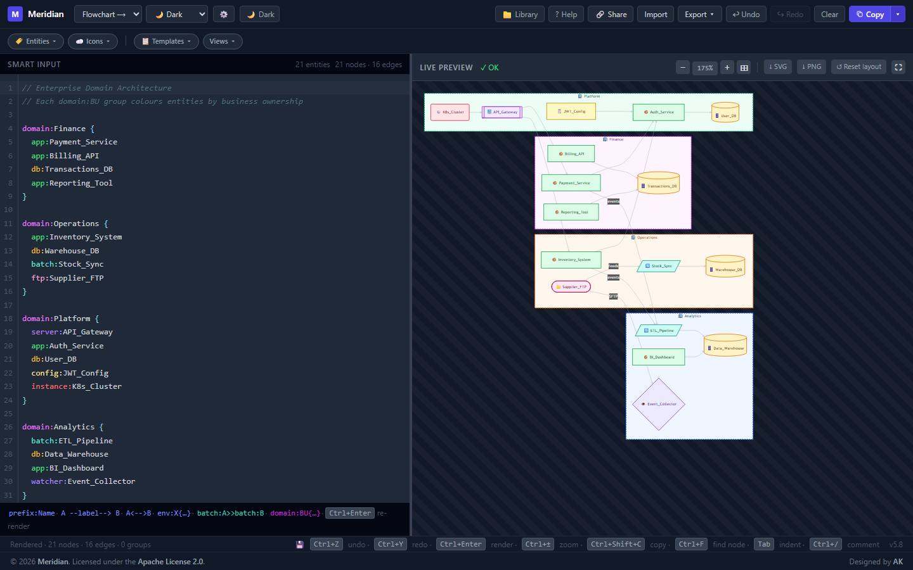

# Meridian

A smart, single-file diagram generator that turns plain-text descriptions of systems into Mermaid.js diagrams — no syntax knowledge required.

**Designed by [AK (Aravind Kannan)](https://github.com/aravindksk7)**

[](LICENSE)



---

## Overview

Meridian lets you describe your architecture, data flows, or system relationships in a simple, readable shorthand and instantly renders a professional diagram. It supports enterprise-grade grouping with business domain ownership, nested subdomains, network zone boundaries, **20 entity types** (including 7 dedicated flowchart shapes), and a rich **Design Board** mode for open-design, Figma-style storytelling — all in a zero-dependency single HTML file. A dedicated **AI icon tab** covers the full modern AI stack, and an **AI / RAG App** template gets you started in seconds.

---

## Getting Started

Meridian is a **single HTML file** — no installs, no dependencies, no build step. It runs entirely in your browser.

### Download or Clone

**Option 1 — Clone with Git** (recommended):

```bash
git clone https://github.com/aravindksk7/meridian.git
cd meridian
```

**Option 2 — Download the ZIP**:

1. Go to the [repository page](https://github.com/aravindksk7/meridian)
2. Click **Code → Download ZIP**
3. Extract the archive to any folder

**Option 3 — Download just the file**:

Right-click → Save As on [`meridian.html`](meridian.html) from the repository — that single file is the entire application.

---

### Run the App

Open `meridian.html` directly in any modern browser (Chrome, Firefox, Edge, Safari):

```bash
# macOS / Linux
open meridian.html

# Windows (PowerShell)
Start-Process meridian.html

# Or simply double-click meridian.html in your file explorer
```

No server. No internet connection required after the first load (CDN assets are cached by the browser).

---

### Example Usage

Once the file is open, type your diagram description into the **Smart Input** panel on the left. The preview updates in real time.

**Basic flow:**

```
app:Frontend --> interface:API --> db:Postgres
```

**Add groupings to show environments and ownership:**

```
env:Production {
  app:Frontend
  app:API
  db:Postgres
}

domain:Engineering {
  app:Frontend
  app:API
}

domain:Data {
  db:Postgres
}
```

**Use natural language connectors:**

```
app:Frontend calls app:API
app:API reads from db:Postgres
batch:ETL writes to db:Warehouse
```

**Chain a pipeline:**

```
batch:Ingest >> batch:Transform >> batch:Load >> db:Warehouse
```

**Flowchart / process diagram:**

```
terminal:Start --> process:Collect_Input --> decision:Is_Valid
decision:Is_Valid --yes--> process:Process_Record --> document:Report --> terminal:End
decision:Is_Valid --no--> io:Re_Enter_Data --> decision:Is_Valid
```

**Pick a template** to jump-start your diagram — click **Templates** in the toolbar and choose from 11 presets (microservices, cloud infra, AI/RAG app, Flow Diagram, Design Board, and more).

> **Tip:** Press `?` or `F1` at any time to open the built-in help reference.

---

## Features

### Editing
- **20 entity types** — app, db, server, instance, interface, config, batch, watcher, ftp, net, domain, subdomain, env, **process, decision, terminal, io, document, predefined, connector**
- **Auto-detection** — smart type inference from names (e.g. `api_gateway` → interface, `postgres` → db, `ec2_instance` → server)
- **Compound name support** — underscore and hyphen separators handled correctly in auto-detection
- **CodeMirror 6 editor** — line numbers, in-place syntax highlighting, undo/redo history, `Ctrl+/` comment toggle
- **Context-aware autocomplete** — type prefixes suggested at line start; after an arrow token the list switches to entity names only
- **Semantic linting** — warnings for orphan nodes, duplicate labels, unknown prefixes, invalid arrows, empty groups, relationships to containers, circular dependencies, and naming convention violations
- **Node Inspector Panel** — collapsible panel showing type badge, name, connections, and group membership at cursor
- **Real-time rendering** — diagram updates as you type

### Grouping & Topology
- **Business domain groupings** — colour-coded dashed subgraphs for team/org ownership (`domain:`)
- **Nested subdomain groupings** — `subdomain:` blocks inside a `domain:` with their own collapse controls
- **Network zones** — security boundary subgraphs with distinct colours (`net:`)
- **Environment blocks** — deployment topology groupings (`env:`)
- **Hybrid mode** — entities can appear in both `env:` and `domain:` simultaneously
- **Colorful collapsible groups** — all grouping types expose live collapse/expand controls that persist

### Live Preview Interactions
- **Drag a node** — repositions node and redraws connected edges + labels in real time; positions persist across reloads and export
- **Drag a domain / subdomain group** — moves all entities inside the group together with the cluster box, edges, and labels; position persists
- **Resize a domain / subdomain** — SE-corner handle resizes the cluster box; entities inside reposition proportionally; survives re-renders
- **Group context panel** — click a domain/subdomain title to open a panel with border colour picker, rename, find in source, and collapse/expand
- **Custom node colour** — node context panel includes a colour swatch; pick any fill colour; overrides Mermaid auto-colour and persists
- **Canvas annotation labels** — toolbar **✚ Label** button places free-floating sticky notes; single-click opens colour popover (background, text, Match BG); double-click edits text; drag to reposition; persists in localStorage
- **↺ Reset layout (plain click)** — refreshes Mermaid auto-layout without clearing manually dragged positions, group positions, sizes, or colours
- **↺ Reset layout (Shift+click)** — clears all positions, sizes, colours, and canvas labels

### Diagrams
- **5 diagram types** — Flowchart LR, Flowchart TD, Design Board, Sequence, Class
- **Design Board renderer** — colourful open-design SVG canvas with lanes, rich cards, gradients, and connection curves
- **5 themes** — Default, Dark, Forest, Neutral, Base
- **All arrow styles** — normal, labelled, bidirectional, pre-dependency, post-dependency, chained (`>>`)
- **Animated edges option** — slow or fast moving-arrow overlays without changing the generated Mermaid code
- **12 natural language connectors** — `connects to`, `calls`, `queries`, `reads from`, `writes to`, `depends on`, and more

### Cloud Service Icon Picker (☁️ Icons ▾)
- **1,313 named services** across five provider tabs — AWS, GCP, Azure, General (256), and AI
- **General tab** — 256 services across 17 subcategories including **Flowchart** (shape palette), **Batch & ETL** (Prefect, Dagster, Pandas, Apache NiFi, Talend, and 10+ more), and **File Storage** (MinIO, Ceph, HDFS, NFS, rsync, and more) — all with correctly resolved Iconify icons
- **AI tab** — 70+ icons covering LLMs, orchestration, vector DBs, MLOps, and LLM serving
- **Search** — filter across all icons in the active tab by service name

### Appearance Settings (⚙️)
- **6 editor colour themes** — Meridian (default), One Dark, Dracula, Nord, Monokai, Solarized Light
- **Font size** — 11 / 13 / 15 / 17 px
- **Font family** — System mono, Fira Code, Cascadia Code, JetBrains Mono
- **Per-entity token colours** — override individual type colours for the active theme
- **Diagram node / edge colours** — override primary fill, border, edge colour, and canvas background

### UI & Theme
- **Dark / light theme** — full CSS design token system, switchable via toolbar
- **Pan & zoom** — drag to pan, Ctrl+scroll, fit-to-window button, quick-pick dropdown (25%–500%)
- **Minimap navigator** — live overview with viewport rectangle
- **Resizable panels** — drag the divider to adjust input/preview split
- **Fullscreen preview** — expand diagram to full viewport

### Keyboard Shortcuts

| Shortcut | Action |
|----------|--------|
| `Ctrl+Enter` | Render diagram |
| `Ctrl+Z` | Undo |
| `Ctrl+Y` / `Ctrl+Shift+Z` | Redo |
| `Ctrl+/` | Toggle `//` comment |
| `Tab` / `Shift+Tab` | Indent / un-indent |
| `Ctrl+Shift+C` | Copy Mermaid code |
| `Ctrl+Shift+I` | Toggle Node Inspector Panel |
| `Ctrl+Shift+S` | Copy share URL |
| `Ctrl+Shift+F` | Toggle fullscreen |
| `Ctrl+Shift+L` | Open diagram library |
| `Ctrl++` / `Ctrl+-` | Zoom in / out |
| `Ctrl+0` | Reset zoom to 100% |
| `Ctrl+F` | Open node search |
| `?` or `F1` | Open help |
| `Escape` | Close modal / cancel label add mode |

---

## Syntax Reference

### Infrastructure Entity Types

| Prefix | Aliases | Shape | Description |
|--------|---------|-------|-------------|
| `app:` | — | Rectangle | Application / service |
| `db:` | `database:` | Cylinder | Database / data store |
| `server:` | `srv:` | Subroutine rect | Server / proxy / load balancer |
| `instance:` | `inst:` | Rounded rect | Container / VM / function |
| `interface:` | `iface:` | Hexagon | API / queue / event bus |
| `config:` | `cfg:, conf:` | Rectangle | Config / secret / cert |
| `batch:` | `btch:` | Parallelogram | Batch job / ETL / pipeline |
| `watcher:` | `watch:` | Diamond | Monitor / observer / file watcher |
| `ftp:` | `sftp:, ftps:` | Stadium | FTP / SFTP transfer |
| `env:` | — | Subgraph | Deployment environment |
| `net:` | `network:, zone:` | Subgraph | Network zone (External / DMZ / Internal) |
| `domain:` | `dom:, team:, biz:, bu:` | Subgraph | Business domain / team ownership |
| `subdomain:` | `subdom:, subteam:, sd:` | Nested subgraph | Capability group inside a domain |

### Flowchart Shape Types

| Prefix | Aliases | Mermaid shape | Description |
|--------|---------|---------------|-------------|
| `process:` | `proc:` | Rectangle | Standard process / task step |
| `decision:` | `dec:, diamond:` | Diamond `{…}` | Decision / branch condition |
| `terminal:` | `term:, start:, end:` | Stadium `([…])` | Start / End terminal |
| `io:` | `input:, output:` | Parallelogram `[/…/]` | Input / Output / data flow |
| `document:` | `doc:` | Asymmetric `>…]` | Document / report output |
| `predefined:` | `subproc:, subprocess:` | Subroutine `[[…]]` | Predefined process / subroutine |
| `connector:` | `join:` | Circle `((…))` | Flow connector / join point |

### Arrow Styles

| Syntax | Style | Best for |
|--------|-------|----------|
| `A --> B` | → Normal | Basic flow |
| `A --label--> B` | → Labelled | Named relationship |
| `A <--> B` | ↔ Bidirectional | Two-way communication |
| `A --pre--> B` | - - → Dashed | Prerequisite |
| `A --post--> B` | ═══▶ Thick | Triggers on completion |
| `A >> B >> C` | ═══▶ Chain | Sequential pipeline |

### Grouping Blocks

```
env:Production {
  app:API
  db:Postgres
}

domain:Finance {
  subdomain:Payments {
    app:Billing
    db:Transactions
  }
}
```

### Natural Language Connectors

```
app:Frontend calls app:Backend
app:Backend reads from db:Postgres
batch:ETL writes to db:Warehouse
```

### Semantic Linting

| Warning | Meaning |
|---------|---------|
| `ORPHAN_NODE` | Entity not connected by any relationship |
| `DUPLICATE_LABEL` | Same label under different entity types |
| `UNKNOWN_PREFIX` | Unrecognised type prefix |
| `EMPTY_GROUP` | Group block has no valid children |
| `CIRCULAR_DEPENDENCY` | Directed cycle detected |
| `NAMING_CONVENTION` | Label violates configured case/length rule |

---

## Quick Start — Flowchart

```
terminal:Start
process:Validate_Input
decision:Is_Valid
io:Read_Data
document:Report
terminal:End

terminal:Start --> process:Validate_Input --> decision:Is_Valid
decision:Is_Valid --yes--> io:Read_Data --> document:Report --> terminal:End
decision:Is_Valid --no--> process:Validate_Input
```

Load the **Flow Diagram** template (Templates → ◇ Flow Diagram) for a ready-made example.

---

## Templates

| # | Name | Covers |
|---|------|--------|
| 1 | Microservices Architecture | Service mesh, API gateway, databases |
| 2 | 3-Tier App | Presentation / logic / data tiers |
| 3 | CI/CD Pipeline | Build → test → deploy batch chain |
| 4 | Cloud Infra | VPC with ALB, ECS, RDS, ElastiCache |
| 5 | ETL Pipeline | Extract → transform → load |
| 6 | File Processing Pipeline | FTP / watcher / batch processing |
| 7 | Network Architecture | External, DMZ, and internal zones |
| 8 | Enterprise Domain Architecture | Multi-domain colour-coded groupings |
| 9 | AI / RAG App | LLM-powered RAG pipeline |
| 10 | Design Board | Open-design canvas with lanes and cards |
| 11 | Flow Diagram | Standard flowchart shapes (process, decision, terminal, I/O, document) |

---

## Project Bundles

Export / Import save the complete state as `.meridian.json` or `.mmd`:
- Smart Input text, diagram type, Mermaid theme
- Editor and diagram settings
- Node positions, group sizes/positions
- Custom entity colours, group border colours
- Canvas annotation labels

---

## Architecture Views

| View | Focus |
|------|-------|
| System Context | People-facing channels, core platform, external systems |
| Container | UI, API, services, data stores, workers, observability |
| Deployment | External, DMZ, and internal runtime topology |
| Domain Ownership | Business domain boundaries with cross-domain flows |

---

## Testing

```bash
npm install
npm test
```

Use `npm run build:icons:dry` to validate icon source JSON, or `npm run build:icons` to regenerate the embedded icon catalog.

---

## Dependencies (CDN)

| Library | Version | Purpose |
|---------|---------|---------|
| [Mermaid.js](https://mermaid.js.org/) | v11 | Diagram rendering |
| [Tailwind CSS](https://tailwindcss.com/) | v3 | Utility styling |
| [CodeMirror](https://codemirror.net/) | v6 | Code editor |

---

## License

Copyright 2026 AK (Aravind Kannan)

Licensed under the [Apache License 2.0](LICENSE).
